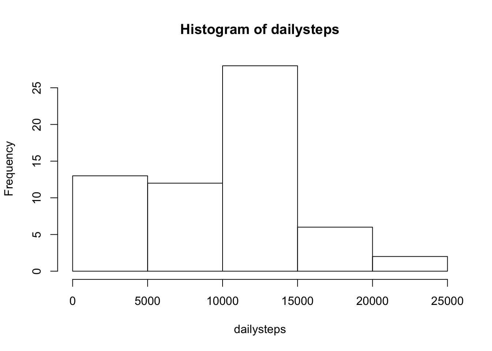
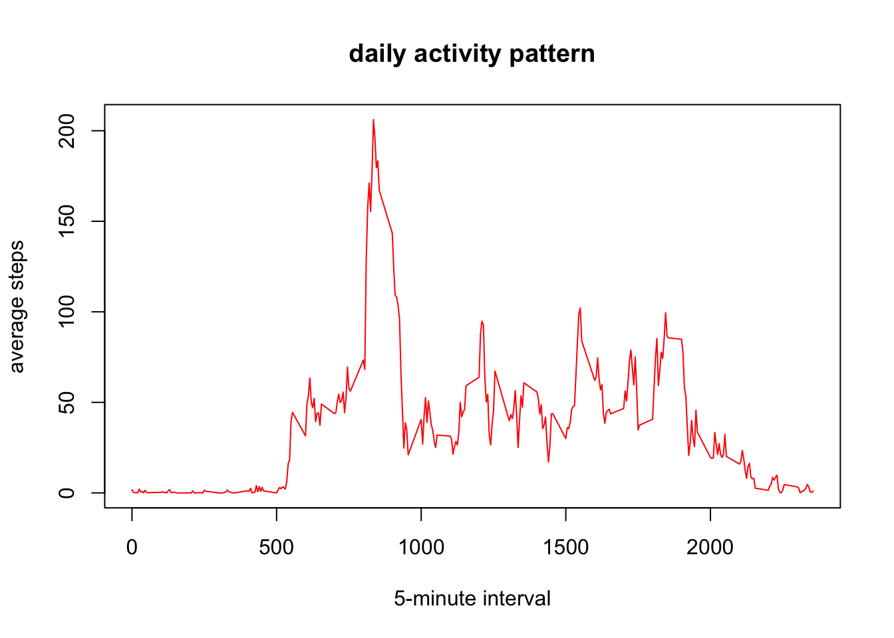
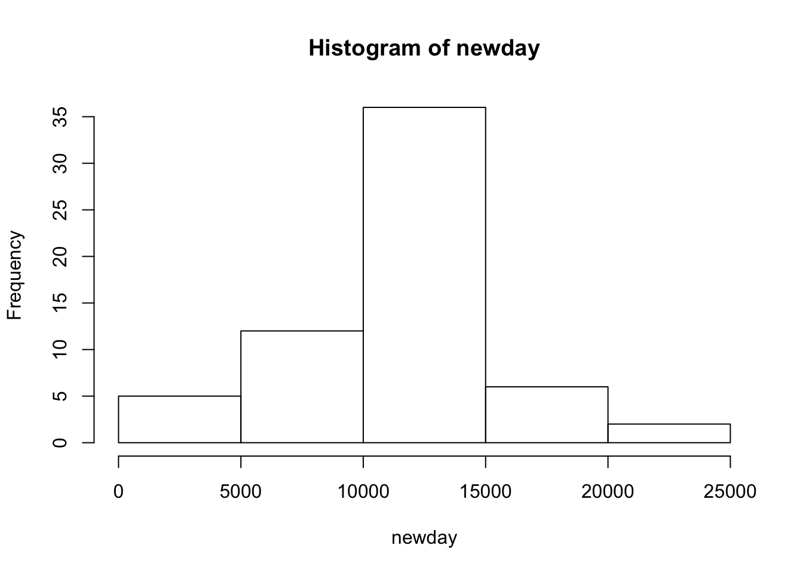
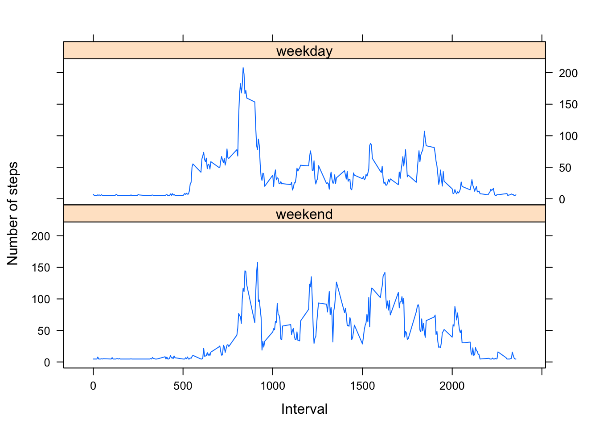

# Loading and preprocessing the data

```r
setwd("/Users/MENGMENG/Desktop")
activity <- read.csv("activity.csv", colClasses = c(
            "numeric", "character", "numeric"))
# check the structure of the dateframe
str(activity)
```

```
## 'data.frame':	17568 obs. of  3 variables:
##  $ steps   : num  NA NA NA NA NA NA NA NA NA NA ...
##  $ date    : chr  "2012-10-01" "2012-10-01" "2012-10-01" "2012-10-01" ...
##  $ interval: num  0 5 10 15 20 25 30 35 40 45 ...
```

```r
# convert date into actual date format
activity$date <- as.Date(activity$date)
```
# What is mean total number of steps taken per day

```r
## calculate and plot the sum of daily steps
dailysteps <- tapply(activity$steps, activity$date, sum, na.rm=TRUE)
hist(dailysteps)
```

 

```r
## calculate the mean and median total number of steps taken per day(NA removed)
mean <- sum(dailysteps) / length(dailysteps)
mean
```

```
## [1] 9354.23
```

```r
median <- median(dailysteps)
median
```

```
## [1] 10395
```
# What is the average daily activity pattern?

```r
## calculate the average steps for every 5-minute interval(NA removed)
intervalavg <- aggregate(activity$steps,
                         by=list(activity$interval),
                         FUN=mean,
                         na.rm=TRUE)
names(intervalavg) <- c("interval", "mean")
```

```r
## plot 
plot(intervalavg, type="l", col="red", 
     xlab="5-minute interval",
     ylab="average steps",
     main="daily activity pattern")
```

 

```r
## find out the most active 5-mins interval
intervalavg[which.max(intervalavg$mean),]
```

```
##     interval     mean
## 104      835 206.1698
```
# Imputing missing values

```r
## calculate and report the total number of missing values in the dataset
NAsum <- sum(is.na(activity))
NAsum
```

```
## [1] 2304
```

```r
## fill in all the missing values with mean of 5-minute interval
for (i in which(sapply(activity, is.numeric))) {
        activity[is.na(activity[, i]), i] <- mean(activity[, i],  na.rm = TRUE)
}
## difference in daily pattern between original dataset and imputed dateset
newday <- tapply(activity$steps, activity$date, sum)
hist(newday)
```

  

```r
mean(newday) - mean
```

```
## [1] 1411.959
```

```r
median(newday) - median
```

```
## [1] 371.1887
```
# Are there differences in activity patterns between weekdays and weekends?

```r
## get the weekday 
datewd <- format(activity$date, "%A")
wd1 <- c('Monday', 'Tuesday', 'Wednesday', 'Thursday', 'Friday')
activity$workday <- factor(datewd %in% wd1, levels=c(FALSE, TRUE), 
                  labels=c('weekend', 'weekday'))

meanSteps <- aggregate(activity$steps, list(as.numeric(activity$interval), activity$workday),
                       FUN = "mean")
names(meanSteps) <- c("interval","weekDays", "avgSteps")
```

```r
library(lattice)
xyplot(meanSteps$avgSteps ~ meanSteps$interval | meanSteps$weekDays, 
       layout = c(1, 2), type = "l", 
       xlab = "Interval", ylab = "Number of steps")
```

 
